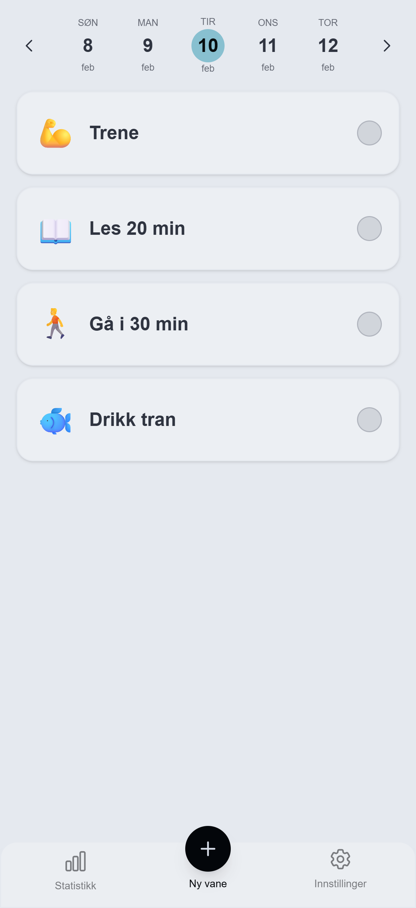

# Daglig Vane Tracker / Daily Habit Tracker 📅


.png | width=201)


## 🇳🇴 Norsk

Dette er en moderne, mobil-først webapplikasjon bygget for å hjelpe brukere med å etablere og vedlikeholde gode daglige vaner. Prosjektet var designet med fokus på **brukeropplevelse (UX)**, **ytelse** og **native-følelse** på mobil gjennom PWA-teknologi.

Applikasjonen lar brukere logge inn sikkert, opprette personlige vaner med emojis, og markere dem som fullført med enkle swipe-bevegelser.

### ✨ Nøkkelfunksjoner
*   **Mobil-optimalisert UI:** Designet fra bunnen av for å føles som en app på telefonen.
*   **Modern Dock Navigasjon:** En lekker og responsiv meny nederst på skjermen som gir rask tilgang til alle hovedfunksjoner.
*   **Statistikk & Streaks:** Hold motivasjonen oppe med oversikt over antall vaner fullført i snitt pr. dag og din "Perfect Day Streak" (antall dager på rad alle vaner er gjort).
.png | width=201)
*   **Progressive Web App (PWA):** Kan installeres på hjemskjermen og kjøres i fullskjerm-modus uten nettleser-ramme.
*   **Swipe-gestures:** Intuitive "swipe-to-reveal" handlinger for redigering og sletting av vaner (laget med Framer Motion).
.png | width=201) .png | width=201)
*   **Autentisering:** Sikker innlogging med Google (NextAuth.js v5).
.png | width=201)
*   **Optimistisk UI:** Umiddelbar respons på brukerhandlinger før serveren bekrefter, for en lynrask opplevelse.
*   **Kalendernavigasjon:** Egendefinert datovelger for å se historikk og planlegge fremtiden.

### 🛠️ Teknologistack
*   **Frontend:** [Next.js 15](https://nextjs.org/) (App Router), [React](https://react.dev/)
*   **Backend:** Next.js Server Actions
*   **Database:** PostgreSQL (hostet på Render)
*   **ORM:** [Prisma](https://www.prisma.io/)
*   **Styling:** [Tailwind CSS](https://tailwindcss.com/), [DaisyUI](https://daisyui.com/)
*   **Animasjoner:** [Framer Motion](https://www.framer.com/motion/)
*   **Auth:** [Auth.js (NextAuth v5)](https://authjs.dev/)

### 🚀 Installasjon og Kjøring

For å kjøre prosjektet lokalt:

1.  **Klon repoet:**
    ```bash
    git clone https://github.com/DITT_BRUKERNAVN/daily-habit-tracker.git
    cd daily-habit-tracker
    ```

2.  **Installer avhengigheter:**
    ```bash
    npm install
    ```

3.  **Sett opp miljøvariabler:**
    Lag en `.env` fil i rotmappen med følgende:
    ```bash
    DATABASE_URL="din_postgresql_connection_string"
    AUTH_SECRET="din_genererte_hemmelighet"
    AUTH_GOOGLE_ID="din_google_client_id"
    AUTH_GOOGLE_SECRET="din_google_client_secret"
    ```

4.  **Kjør database-migrering:**
    ```bash
    npx prisma generate
    npx prisma db push
    ```

5.  **Start utviklingsserveren:**
    ```bash
    npm run dev
    ```

---

## 🇬🇧 English

This is a modern, mobile-first web application built to help users establish and maintain good daily habits. The project was designed with a strong focus on **User Experience (UX)**, **performance**, and a **native-feel** on mobile devices using PWA technology.

The application allows users to securely log in, create personalized habits with emojis, and mark them as complete with simple swipe gestures.

### ✨ Key Features
*   **Mobile-Optimized UI:** Designed from the ground up to feel like a native app on your phone.
*   **Modern Dock Navigation:** A sleek and responsive menu at the bottom of the screen for quick access to core features.
*   **Statistics & Streaks:** Stay motivated with insights into your daily completion average and "Perfect Day Streak" (consecutive days with all habits completed).
*   **Progressive Web App (PWA):** Installable to the home screen and runs in fullscreen mode without browser chrome.
*   **Swipe Gestures:** Intuitive "swipe-to-reveal" actions for editing and deleting habits (powered by Framer Motion).
*   **Authentication:** Secure login with Google (NextAuth.js v5).
*   **Optimistic UI:** Immediate feedback on user actions before server confirmation, ensuring a snappy experience.
*   **Calendar Navigation:** Custom date selector to view history and plan ahead.

### 🛠️ Tech Stack
*   **Frontend:** [Next.js 15](https://nextjs.org/) (App Router), [React](https://react.dev/)
*   **Backend:** Next.js Server Actions
*   **Database:** PostgreSQL (hosted on Render)
*   **ORM:** [Prisma](https://www.prisma.io/)
*   **Styling:** [Tailwind CSS](https://tailwindcss.com/), [DaisyUI](https://daisyui.com/)
*   **Animations:** [Framer Motion](https://www.framer.com/motion/)
*   **Auth:** [Auth.js (NextAuth v5)](https://authjs.dev/)



### 🚀 Installation & Setup

To run the project locally:

1.  **Clone the repository:**
    ```bash
    git clone https://github.com/YOUR_USERNAME/daily-habit-tracker.git
    cd daily-habit-tracker
    ```

2.  **Install dependencies:**
    ```bash
    npm install
    ```

3.  **Set up environment variables:**
    Create a `.env` file in the root directory with the following:
    ```bash
    DATABASE_URL="your_postgresql_connection_string"
    AUTH_SECRET="your_generated_secret"
    AUTH_GOOGLE_ID="your_google_client_id"
    AUTH_GOOGLE_SECRET="your_google_client_secret"
    ```

4.  **Run database migrations:**
    ```bash
    npx prisma generate
    npx prisma db push
    ```

5.  **Start the development server:**
    ```bash
    npm run dev
    ```
